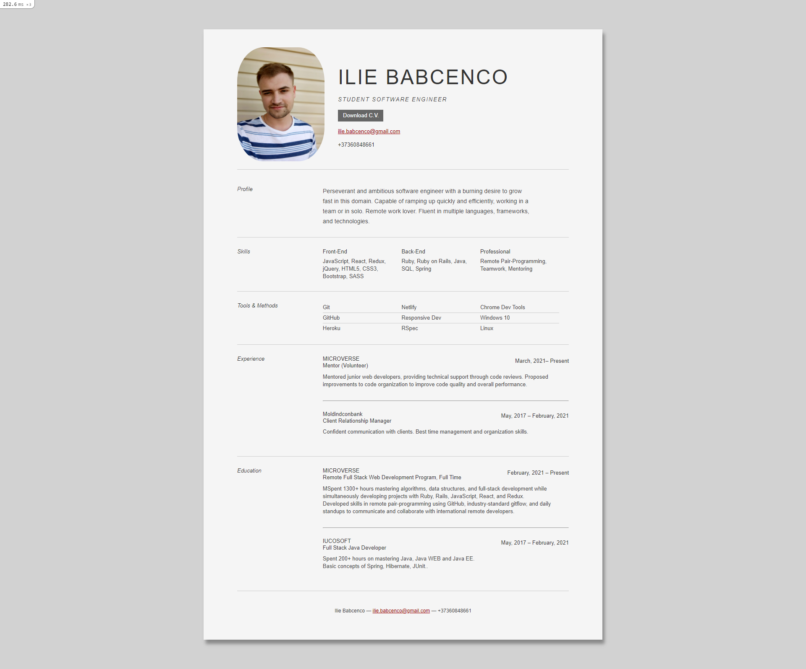

# Ruby on Rails Resume Project

This is the project from freeCodeCamp course which I did for learning purposes.

## Description

This project includes my Resume data, with my resume in pdf format available for downloading.

## Built With

- Ruby on Rails
- HTML/CSS

## How it looks

### Deployment

This application is deployed on [Heroku](https://www.heroku.com/)

## Authors

👤 **Ilie Babcenco**

- GitHub: [@iliebabcenco](https://github.com/iliebabcenco)
- LinkedIn: [@iliebabcenco](https://www.linkedin.com/in/ilie-babcenco-72459a1b1/)
- Twitter: [@iliebabcenco](https://twitter.com/BabcencoIlie)

## 🤝 Contributing

Contributions, issues, and feature requests are welcome!

If you want to contribute, you can clone this project or fork it.

If you found an issue, feel free to check the [issues page](https://github.com/iliebabcenco/friends-railsapp/issues).

## Show your support

Give a ⭐️ if you like this project!
